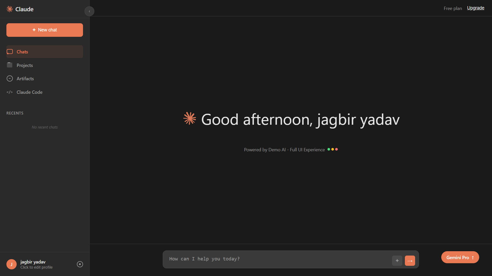

# Claude Clone

A fully functional web-based replica of the Claude AI chat interface with both demo mode and real API integration capabilities.



## Table of Contents

- [Overview](#overview)
- [Features](#features)
- [Demo Mode](#demo-mode)
- [Real API Integration](#real-api-integration)
- [Getting Started](#getting-started)
- [Usage](#usage)
- [Project Structure](#project-structure)
- [Technologies Used](#technologies-used)
- [Customization](#customization)
- [Contributing](#contributing)
- [License](#license)
- [Author](#author)

## Overview

This project is a pixel-perfect replica of the Claude AI chat interface, built with HTML, CSS, and vanilla JavaScript. It offers a complete user experience with features like chat history, responsive design, and both demo mode and real API integration with Google's Gemini 2.5 Flash model.

## Features

- 🎨 **Pixel-Perfect UI**: Faithful recreation of Claude's interface with attention to detail
- 💬 **Real-time Chat**: Smooth messaging experience with typing indicators
- 📱 **Fully Responsive**: Works on desktop, tablet, and mobile devices
- 📚 **Chat History**: Save and load previous conversations
- 🌙 **Dark Theme**: Modern dark interface with gradient accents
- ⚙️ **Profile Management**: Customize your name, interests, and API settings
- 🗂️ **Sidebar Navigation**: Collapsible sidebar with chat organization
- 🔧 **Multiple Sections**: Chats, Projects, Artifacts, and Claude Code sections
- 🔄 **Smooth Animations**: Subtle transitions and hover effects

## Demo Mode

The application works completely offline in demo mode with simulated AI responses. This mode is perfect for:
- Testing the UI without an API key
- Demonstrating the interface functionality
- Quick prototyping and development

## Real API Integration

For a full AI experience, connect your Google Gemini API key to get real responses from the Gemini 2.5 Flash model:
- Real-time AI responses
- Access to latest AI capabilities
- Personalized interactions based on your interests

To get your free API key:
1. Visit [Google AI Studio](https://aistudio.google.com/app/apikey)
2. Create an API key
3. Enter it in the setup screen or profile settings

## Getting Started

### Prerequisites

- A modern web browser (Chrome, Firefox, Safari, Edge)
- For real API functionality: A Google Gemini API key (free)

### Installation

1. Clone or download this repository:
```bash
git clone https://github.com/jagbiryadav/Claude-clone.git
```

2. Navigate to the project directory:
```bash
cd claude clone
```

3. Open `index.html` in your web browser

That's it! The application will run directly in your browser with no additional setup required.

### Alternative Setup

You can also:
- Host the files on any web server
- Use a local development server like Live Server extension in VS Code
- Open the HTML file directly in your browser

## Usage

1. **Initial Setup**:
   - Enter your name (required)
   - Optionally add your interests/focus areas
   - Optionally enter a Gemini API key for real responses

2. **Chatting**:
   - Type your message in the input field at the bottom
   - Press Enter or click the send button
   - View AI responses with typing indicators

3. **Navigation**:
   - Use the sidebar to access different sections
   - Collapse/expand the sidebar using the toggle button
   - Start new chats with the "New chat" button
   - View and manage chat history in the sidebar

4. **Profile Management**:
   - Click on your profile in the sidebar to open settings
   - Update your name and interests
   - Change or add your API key
   - Clear all chat history

## Project Structure

```
claude-clone/
├── index.html    # Main HTML file with UI and embedded CSS
├── claude-app.js            # JavaScript logic and functionality
├── images/                  # Screenshot and other images
│   └── claude-ui-screenshot.png
└── README.md                # This file
```

### Key Files

- **index.html**: Contains the complete UI structure, styling, and layout
- **claude-app.js**: Implements all application logic including:
  - Chat functionality
  - API integration
  - Local storage management
  - UI interactions and animations

## Technologies Used

- **HTML5**: Semantic markup and structure
- **CSS3**: Advanced styling with flexbox, gradients, and animations
- **JavaScript (ES6+)**: Modern JavaScript for application logic
- **Local Storage**: For persisting user data and chat history
- **Google Gemini API**: For real AI responses (optional)
- **Responsive Design**: Media queries for cross-device compatibility

## Customization

### Changing Colors

The color scheme is defined in the CSS variables. You can customize the colors by modifying these values in the `<style>` section:

```css
:root {
  --primary-color: #e87953;
  --primary-dark: #d66b47;
  --primary-darker: #c55a3a;
  --sidebar-bg: #2a2a2a;
  --message-bg: #3a3a3a;
}
```

### Adding New Features

To extend functionality:
1. Add new UI elements in the HTML
2. Implement logic in `claude-app.js`
3. Use consistent styling with existing CSS classes
4. Store persistent data in localStorage

### Modifying API Integration

To use a different AI model:
1. Update the API endpoint in `claude-app.js`
2. Modify the request format to match the new API
3. Adjust the response handling logic

## Contributing

Contributions are welcome! Here's how you can help:

1. Fork the repository
2. Create a feature branch:
   ```bash
   git checkout -b feature/YourFeature
   ```
3. Commit your changes:
   ```bash
   git commit -m 'Add some feature'
   ```
4. Push to the branch:
   ```bash
   git push origin feature/YourFeature
   ```
5. Open a pull request

### Areas for Improvement

- Add more AI model integrations
- Implement additional Claude features (artifacts, projects)
- Enhance mobile experience
- Add internationalization support
- Improve accessibility features

## License

This project is open source and available under the [MIT License](LICENSE).

## Author

**Jagbir yadav** - Python & frontend Developer

- GitHub: [@jagbiryadav](https://github.com/jagbiryadav/)
- LinkedIn: [@jagbir-yadav](https://www.linkedin.com/in/jagbir-yadav/)

---


⭐ If you find this project useful, please consider giving it a star on GitHub!


